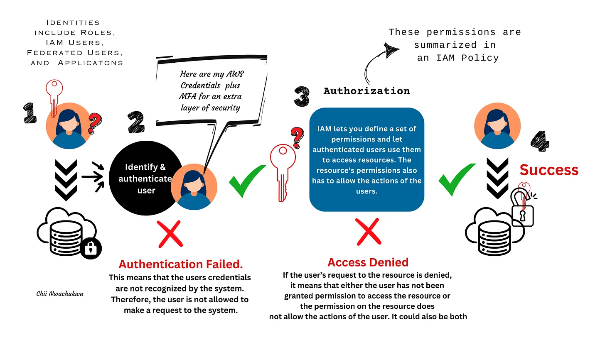
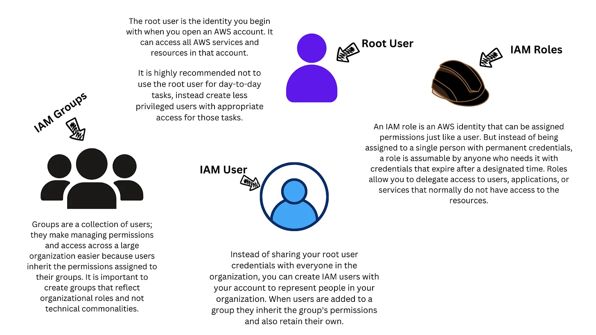
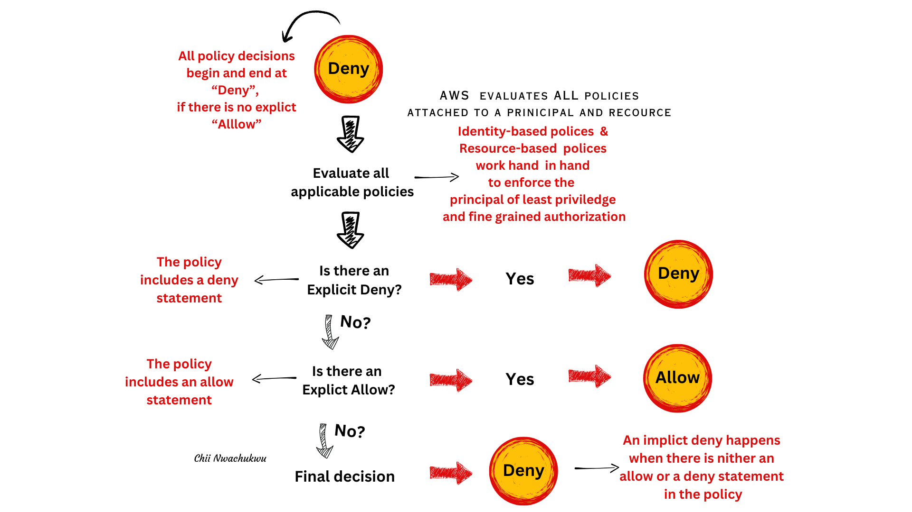
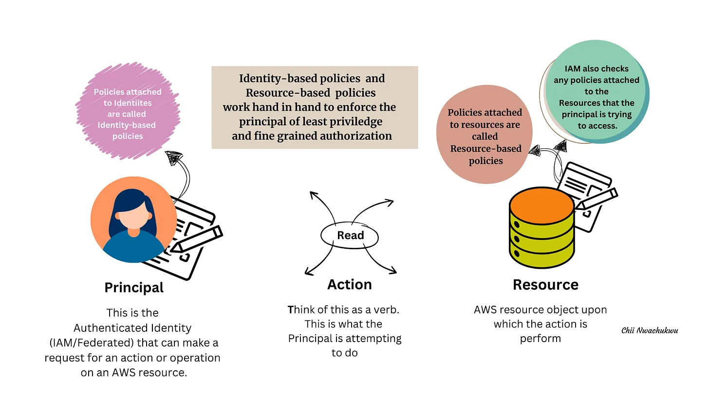

# Identity-Access-Management

_I have two questions for you:_

1. How do we protect our application from unauthorized access, use, or modification?
2. How do we control and place a limit on information access or disclosure to authorized users and prevent access from unauthorized users?

Answer: By implementing a security structure built on strong authorization and the principle of least privilege. Here, we grant access as needed, enforce separation of duties, avoid long-term credentials, and provide a user or resource with the privilege that is essential to perform its intended function.

In other words, we deny everything and allow only what is needed based on organizational roles. This is known as the principle of least privilege. Amazon’s Identity & Access Management (IAM) allows us to implement this and more. IAM is a centralized mechanism for creating and managing individual users and their permissions within your AWS system. Using IAM, we can implement the principle of least privilege and enforce separation of duties with appropriate and granular authorization for each interaction with AWS resources.

---

## What is an identity?

This is the who or what needs access to our application. Identities in AWS include IAM Users, IAM Groups, IAM Roles, and Root Users. Identities can also be external as organizations can authenticate their users outside IAM using Identity Federation. This is very useful for large organizations with multiple accounts as it is highly scalable.

- Root User
- IAM User
- IAM Roles
- IAM Groups

## Access Management Concepts

### Authentication

- This is the process of validating a user’s credentials and ensuring that the system recognizes said user's identity as who they claim to be. After authentication, a user is granted the ability to make requests to the system's resources. When a request is authenticated via the principal - a user, role, or application that can make a request for an action or operation on an AWS resource -, IAM gathers context about the principal and the call itself. Examples of such authentication context include the principal’s Amazon Resource Name (ARN), the principal’s attributes and tags, etc.

### Authorization

- This is the process of validating a user’s permission to access or perform certain actions on a resource. That a user is authenticated does not automatically permit them to access the resources in the system. Permissions and access in AWS are managed by creating policies and attaching them to IAM / federated identities. During authorization, IAM uses values from the request context to check for policies that apply to the request and then use the policies to determine whether to allow or deny the request.

- An IAM Policy defines the permission of the Identity or Resource it is attached to. Some policies are used to restrict access while others are used to grant access. Using a combination of different policy types not only improves your overall security posture but also minimizes the impact of a security incident.

